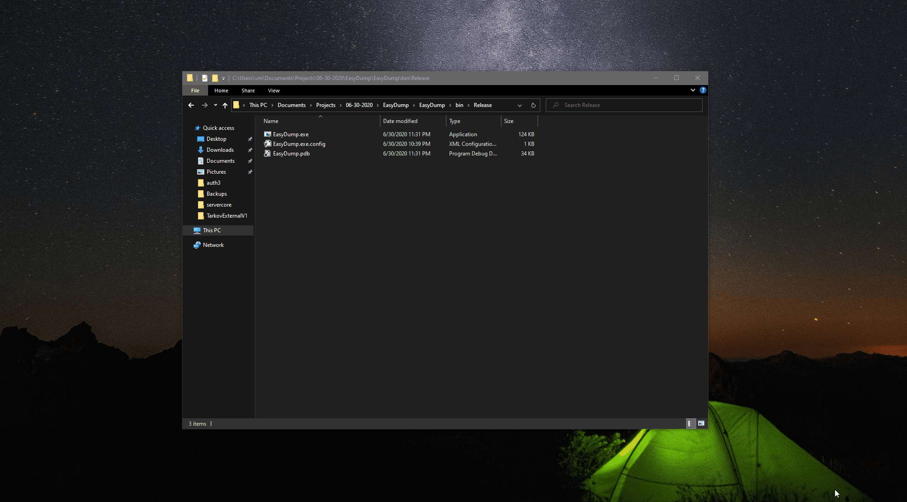

# EasyDump
This is a simple program with just a one button made to simplify process of getting crashdumps. It will compress last minidump and some basics system information into file selected by the user.

